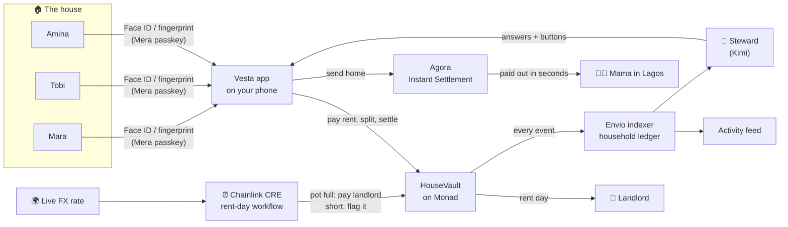

# Vesta

**The bank account for a household, not just a person.**

Shared rent, bill splits and money sent home, in one app you open with your face or fingerprint.

**Try it:** https://vesta-pi-neon.vercel.app (Monad testnet, test money only) · [Testing guide](docs/testing-guide.md)

Built for the Monad Metropolis hackathon (Consumer Products & Payments).

## The problem

Amina lives in Hackney with two housemates. Her mum lives in Lagos. Every month she:

- **chases rent** over WhatsApp and hopes the landlord gets paid on time
- **keeps a mental tab** of who paid for dinner, the electric bill and the toilet roll
- **sends money home** through a service that charges a fee, takes a cut on the rate and still takes days

That's three apps, a spreadsheet in her head and a lot of awkward conversations. Banks are built for one person. Real life money is shared: a house, a family, people in two countries.

## What Vesta does

| Before | With Vesta |
|---|---|
| One person fronts the rent and chases everyone else | Everyone pays their share into one **rent pot**. On rent day it pays the landlord by itself. |
| Nobody knows who's short until the landlord calls | Three days before rent day, the house sees who's behind. Nobody has to be the one who chases. |
| "I'll pay you back for dinner" and then nobody does | Add the cost once, everyone **settles with one tap**. |
| Money home costs a fee and takes days | Money home arrives **in seconds with no fee**, settled instantly through Agora. |
| Passwords, seed phrases, wallet apps | **One passkey.** Your phone is the account. Lose it, and your passkey brings everything back. |
| Nobody keeps the books | A **steward** (powered by Kimi) answers "who still owes rent?" and hands you a button to fix it. |

## How it fits together



1. **You sign in once** with a passkey. Mera's PRF output becomes the root key, and separate keys are derived from it for signing, for each house and for the steward's memory. Nothing secret is stored on a server.
2. **Money lives in HouseVault** on Monad: the rent pot, who has paid this cycle, who owes whom from shared costs.
3. **Money home** goes through Agora's Instant Settlement pair inside the same transaction, so the recipient is paid out immediately.
4. **Rent day runs itself.** A Chainlink CRE workflow checks every house daily with a live exchange rate and either pays the landlord or flags who's short.
5. **Envio indexes everything** into a household ledger that powers the feed and gives the steward its memory of what happened.
6. **The steward** reads the house and the ledger through Kimi tool calls, answers in plain words and suggests actions. It can never move money itself. Your passkey always has the last word.

## Who it's for first

Diaspora housemates in the UK who share rent and send money home to Nigeria, Ghana and Kenya. Millions of people feel this every month, and today they patch it together with bank transfers, WhatsApp reminders and remittance apps.

## What's here

| Path | What it is |
|---|---|
| `apps/web` | The app. Next.js, mobile-first, installable on a phone. Mera passkeys are the only account layer. |
| `contracts` | `HouseVault.sol`: rent pot, splits, settling up, send home through Agora, encrypted house notes, CRE report receiver. Hardhat 3 with tests. |
| `cre` | Chainlink CRE rent-day workflow. Reads every house, checks the FX rate, pays the landlord or flags who is short. |
| `indexer` | Envio HyperIndex. Indexes HouseVault into a household ledger (feed, balances, rent cycles). |
| `docs` | Testing guide for new users. |

## Built with

| | Used for |
|---|---|
| **Monad** | Every payment, split and rent cycle is a real testnet transaction. |
| **Mera** | Passkey accounts, with PRF-derived keys for signing, house notes and steward memory. |
| **Agora** | AUSD balances and instant settlement for money sent home. |
| **Chainlink CRE** | The rent-day workflow that pays the landlord or flags shortfalls. |
| **Envio** | The household ledger behind the activity feed and the steward. |
| **Kimi** | The steward: tool calling over the house, the ledger and live FX rates. |

## Run it

```bash
pnpm install
pnpm dev
```

Contracts:

```bash
cd contracts
pnpm test
```

Rent-day workflow:

```bash
cd cre
cre workflow simulate rent-day --target staging-settings
```

## Live on Monad testnet

| | Address |
|---|---|
| HouseVault | `0x1cb8182e22e7716f9dc9174f1be7591157288559` |
| AUSD | `0xa9012a055bd4e0eDfF8Ce09f960291C09D5322dC` |
| Agora AUSD/CTK pair | `0x1Aa8958Aa34cEC8096EF4381cb335effe977b0ae` |
| Envio GraphQL | https://indexer.dev.hyperindex.xyz/e32f57e/v1/graphql |
