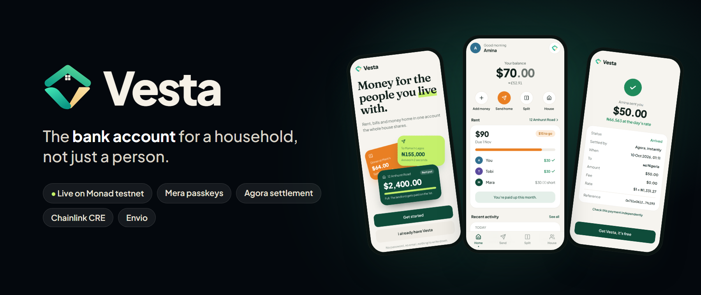
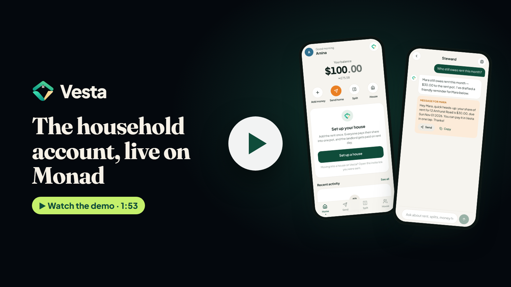
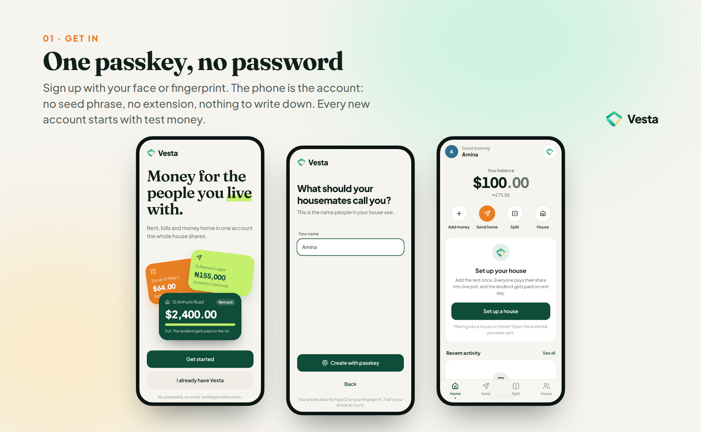
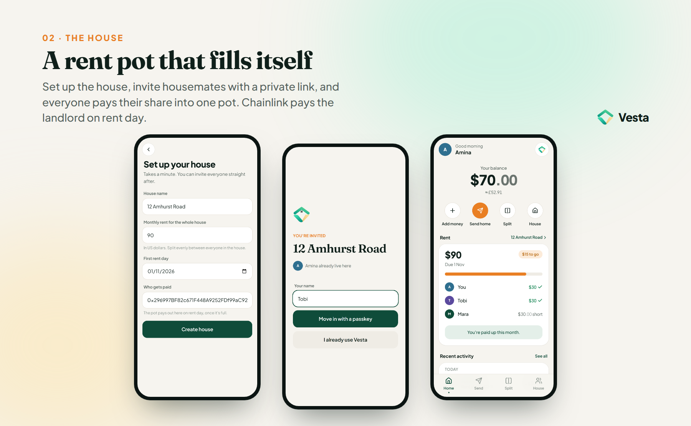
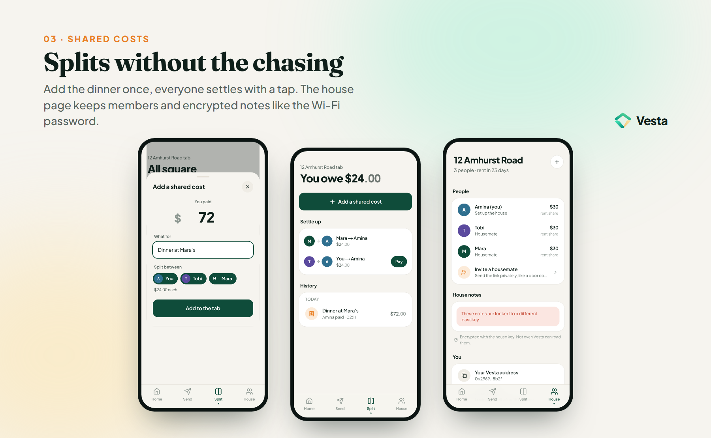
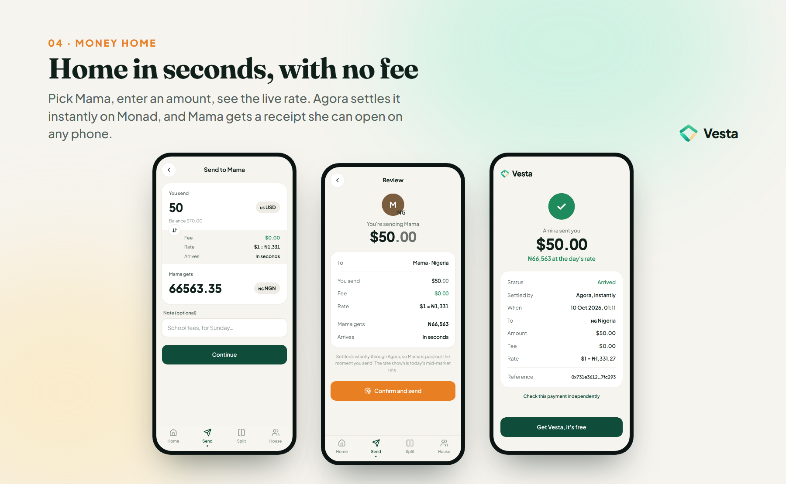
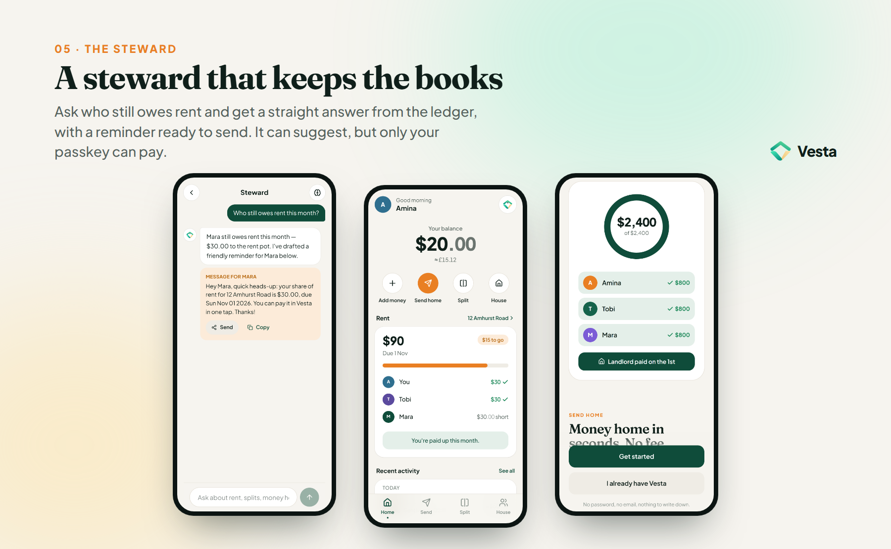

<p align="center"></p>

<p align="center">
  <a href="https://vesta-pi-neon.vercel.app"><b>Try the live app</b></a> ·
  <a href="media/videos/vesta-demo.mp4"><b>Demo video (1:53)</b></a> ·
  <a href="#product-tour">Product tour</a> ·
  <a href="docs/testing-guide.md">Testing guide</a> ·
  <a href="SUBMISSION.md">Submission</a> ·
  <a href="https://sourcify.dev/server/repo-ui/10143/0x1cb8182e22e7716f9dc9174f1be7591157288559">Verified contract</a>
</p>

<p align="center">
  <a href="https://github.com/angelraph/vesta/actions/workflows/ci.yml"></a>
</p>

# Vesta

**The bank account for a household, not just a person.** Shared rent, bill splits and money sent home, in one app you open with your face or fingerprint. Live on Monad testnet, so the money is test money.

Built for the Monad Metropolis hackathon (Consumer Products & Payments).

[](media/videos/vesta-demo.mp4)

*Every clip is the live app on Monad testnet: two phones with real passkeys, real transactions, nothing mocked. How it was made is in [video/](video).*

## At a glance

| | |
|---|---|
| **Live app** | https://vesta-pi-neon.vercel.app, installable on a phone |
| **Network** | Monad testnet (chain 10143). Every payment, split and rent cycle is a real transaction |
| **Accounts** | One Mera passkey. No password, no seed phrase, no custody backend |
| **Money home** | AUSD, settled instantly through Agora's Instant Settlement pair inside the send |
| **Rent day** | A Chainlink CRE workflow pays the landlord or flags who's short, checked live with `--broadcast` |
| **History** | Envio HyperIndex household ledger, hosted |
| **Steward** | An AI agent with read-only tools over the house; it suggests, the passkey decides |
| **Contracts** | `HouseVault` and `GasTap`, both [verified on Sourcify](https://sourcify.dev/server/repo-ui/10143/0x1cb8182e22e7716f9dc9174f1be7591157288559) |
| **Tests** | 11 contract tests, plus CI on every push: contract tests, app types and lint, workflow types |
| **Tested by people** | Real testers from our community, on their own phones ([testing guide](docs/testing-guide.md)) |

## The problem

Amina lives in Hackney with two housemates. Her mum lives in Lagos. Every month she:

- **chases rent** over WhatsApp and hopes the landlord gets paid on time
- **keeps a mental tab** of who paid for dinner, the electric bill and the toilet roll
- **sends money home** through a service that charges a fee, takes a cut on the rate and still takes days

That's three apps, a spreadsheet in her head and a lot of awkward conversations. Banks are built for one person. Real life money is shared: a house, a family, people in two countries.

## What Vesta does

| Before | With Vesta |
|---|---|
| One person fronts the rent and chases everyone else | Everyone pays their share into one **rent pot**. On rent day it pays the landlord by itself. |
| Nobody knows who's short until the landlord calls | Three days before rent day, the house sees who's behind. Nobody has to be the one who chases. |
| "I'll pay you back for dinner" and then nobody does | Add the cost once, everyone **settles with one tap**. |
| Money home costs a fee and takes days | Money home arrives **in seconds with no fee**, settled instantly through Agora. |
| Passwords, seed phrases, wallet apps | **One passkey.** Your phone is the account. Lose it, and your passkey brings everything back. |
| Nobody keeps the books | A **steward** (an AI agent) answers "who still owes rent?" and hands you a button to fix it. |

## Product tour

Every screen below is a real screenshot of the live app on Monad testnet, taken by a script that signs up three housemates with passkeys and runs the whole flow ([video/screens.py](video/screens.py)).











## Videos

| Video | Length | What it shows |
|---|---|---|
| [Demo](media/videos/vesta-demo.mp4) | 1:53 | The whole product on two phones: sign-up, house, rent, splits, money home, steward, and the passkey restore |
| [Agora](media/videos/vesta-agora.mp4) | 1:30 | Passkey onboarding, AUSD balance, a send settled instantly through Agora, the onchain proof and the receipt |
| [Chainlink CRE](media/videos/vesta-cre.mp4) | 1:42 | The rent-day workflow's code, two real `--broadcast` runs, and the shortfall and payout onchain |

## How it fits together


1. **You sign in once** with a passkey. Mera's PRF output becomes the root key, and separate keys are derived from it for signing, for each house and for the steward's memory. Nothing secret is stored on a server.
2. **Money lives in HouseVault** on Monad: the rent pot, who has paid this cycle, who owes whom from shared costs.
3. **Money home** goes through Agora's Instant Settlement pair inside the same transaction, so the recipient is paid out immediately.
4. **Rent day runs itself.** A Chainlink CRE workflow checks every house daily with a live exchange rate and either pays the landlord or flags who's short.
5. **Envio indexes everything** into a household ledger that powers the feed and gives the steward its memory of what happened.
6. **The steward** reads the house and the ledger through AI tool calls (OpenAI), answers in plain words and suggests actions. It can never move money itself. Your passkey always has the last word.

## Who it's for first

Diaspora housemates in the UK who share rent and send money home to Nigeria, Ghana and Kenya. Millions of people feel this every month, and today they patch it together with bank transfers, WhatsApp reminders and remittance apps.

## What's here

| Path | What it is |
|---|---|
| `apps/web` | The app. Next.js, mobile-first, installable on a phone. Mera passkeys are the only account layer. |
| `contracts` | `HouseVault.sol`: rent pot, splits, settling up, send home through Agora, encrypted house notes, CRE report receiver. Hardhat 3 with tests. |
| `cre` | Chainlink CRE rent-day workflow. Reads every house, checks the FX rate, pays the landlord or flags who is short. |
| `indexer` | Envio HyperIndex. Indexes HouseVault into a household ledger (feed, balances, rent cycles). |
| `docs` | Testing guide for new users. |
| `media` | README images built from real screenshots, and the three videos. |
| `video` | The scripts that recorded and edited the videos and took the screenshots. |
| `brand` | The Vesta mark as SVG, the original logo and app icons. |

## Built with

| | Used for |
|---|---|
| **Monad** | Every payment, split and rent cycle is a real testnet transaction. |
| **Mera** | Passkey accounts, with PRF-derived keys for signing, house notes and steward memory. |
| **Agora** | AUSD balances and instant settlement for money sent home. |
| **Chainlink CRE** | The rent-day workflow that pays the landlord or flags shortfalls. |
| **Envio** | The household ledger behind the activity feed and the steward. |
| **OpenAI** | The steward: tool calling over the house, the ledger and live FX rates. |

## Run it

```bash
pnpm install
pnpm dev
```

Contracts:

```bash
cd contracts
pnpm test
```

Rent-day workflow:

```bash
cd cre
cre workflow simulate rent-day --target staging-settings
```

## Live on Monad testnet

| | Address |
|---|---|
| HouseVault (verified) | [`0x1cb8182e22e7716f9dc9174f1be7591157288559`](https://sourcify.dev/server/repo-ui/10143/0x1cb8182e22e7716f9dc9174f1be7591157288559) |
| GasTap (verified) | [`0x48fc665129ac0007f2c8d6d9ac9784f8650841cd`](https://sourcify.dev/server/repo-ui/10143/0x48fc665129ac0007f2c8d6d9ac9784f8650841cd) |
| AUSD | `0xa9012a055bd4e0eDfF8Ce09f960291C09D5322dC` |
| Agora AUSD/CTK pair | `0x1Aa8958Aa34cEC8096EF4381cb335effe977b0ae` |
| Envio GraphQL | https://indexer.dev.hyperindex.xyz/e32f57e/v1/graphql |

### Proof transactions

| What | Transaction |
|---|---|
| Money home, settled by Agora in one transaction | [`0x05c3…b2f5`](https://testnet.monadexplorer.com/tx/0x05c3f43dbb03b51c9507cb26687a82b52bfe353ddb4c2a09fb7ce1eab9a2b2f5) |
| CRE rent day: shortfall flagged | [`0xdba7…c786`](https://testnet.monadexplorer.com/tx/0xdba7b20dfab5d7eef99399fcba6103cad97ff879adf6262a975b530374ffc786) |
| CRE rent day: landlord paid | [`0xe23a…4014`](https://testnet.monadexplorer.com/tx/0xe23acc6217a14f040d29fcc8cbe12d2b56d5515148997baf862ade9ef6264014) |

## Security and privacy

- **No custody.** Keys are derived on the phone from the passkey's PRF output and never leave it. The server only sponsors network fees and hands out test money.
- **Separate keys for separate jobs.** The signing key, each house's key and the steward's memory key come from the same passkey through different HKDF namespaces, so one never reveals another.
- **Encrypted house data.** House notes and the steward's memory are stored onchain as ciphertext. The house key travels in the invite link after `#`, which browsers never send to a server.
- **Rent can't be paid out early.** `collectRent` checks the due date and the pot. Rent-day reports are only accepted from the Chainlink forwarder.
- **The steward can't move money.** It has read-only tools. Every payment needs the person's passkey.
- **Session lock.** The app locks itself after 15 minutes without use.

## Risks and limits

- Vesta runs on **Monad testnet** with test AUSD. The money is not real yet.
- `HouseVault` has **not had an external audit**. It holds pooled rent, so an audit comes before any mainnet launch.
- Money home is paid out in Agora's testnet pair token (CTK) standing in for a local-currency stablecoin. Real cash-out to naira, cedis or shillings needs a licensed off-ramp partner.
- The rent-day workflow runs as a CRE **simulation with `--broadcast`**. Deploying it to the CRE network needs deployment access from Chainlink.
- Passkeys with PRF need **iOS 18+ Safari or Chrome on Android**. In-app browsers (Instagram, Facebook, Telegram) are detected and told to open the link in a browser.
- The steward runs on OpenAI, so its answers are only as good as the model; every number it gives comes from a tool call against the contract or the indexer.
